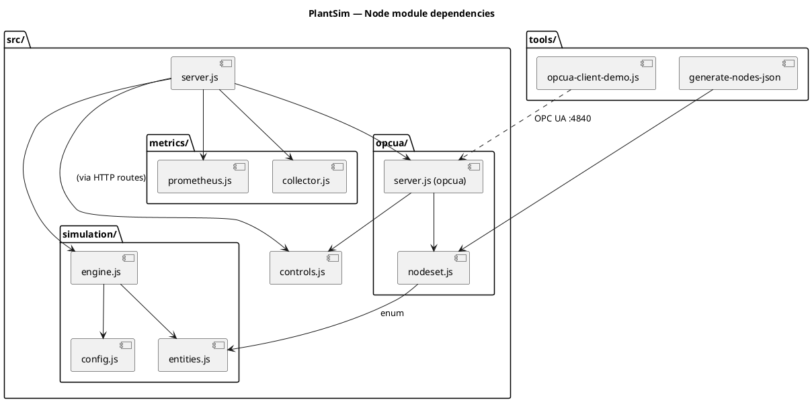

# OPC UA Server Implementation Plan

> **For agentic workers:** REQUIRED SUB-SKILL: Use superpowers:subagent-driven-development (recommended) or superpowers:executing-plans to implement this plan task-by-task. Steps use checkbox (`- [ ]`) syntax for tracking.

**Goal:** Embed an OPC UA server in the PlantSim Node.js process that exposes a dedicated singleton "plant" `SimulationEngine` as a browsable, controllable OPC UA address space, demonstrable via UAExpert and a small node-opcua client script.

**Architecture:** Single Node.js / Fastify process holds (a) the existing per-session browser engines, and (b) one additional dedicated `SimulationEngine` ("plant engine") owned by the OPC UA layer. `src/opcua/nodeset.js` declares the node tree. `src/opcua/server.js` builds the address space, binds getters to plant-engine fields (no per-tick push), and registers methods (`Play/Pause/Reset/SetSpeed`) that go through a shared `src/controls.js` module. Browser UI and HTTP routes are not modified.

**Tech Stack:** Node.js (ESM), Fastify 4, `node-opcua` 2.x, `node:test` (Node's built-in test runner — zero new deps), Docker Compose, PlantUML for diagrams.

**Spec:** `docs/superpowers/specs/2026-06-30-opcua-server-design.md`

---

## File structure

| Path | Status | Responsibility |
|---|---|---|
| `package.json` | modify | Add `node-opcua` dep; add `test` script |
| `src/controls.js` | create | Plain functions wrapping `engine.play/pause/reset/setSpeed`; importable by HTTP + OPC UA |
| `src/opcua/nodeset.js` | create | Declarative node tree (browseName, dataType, path, getter) + JSON export |
| `src/opcua/server.js` | create | Build OPC UA server, install address space from nodeset, register methods, lifecycle |
| `src/opcua/__tests__/nodeset.test.js` | create | Snapshot test on `docs/opcua/nodes.json`; structural assertions |
| `src/opcua/__tests__/server.test.js` | create | In-process server + client round-trip: subscribe to a variable, call a method |
| `src/server.js` | modify | Construct plant engine at startup, boot OPC UA server, wire shutdown |
| `tools/opcua-client-demo.js` | create | Demo client that subscribes to a few nodes and prints values |
| `docs/opcua/nodes.json` | create | Generated node-tree definition (the lecturer's deliverable) |
| `docs/architecture/c4-container.puml` | create | C4 Container diagram (PlantUML) |
| `docs/architecture/components.puml` | create | UML Component diagram (PlantUML) |
| `docker-compose.yml` | modify | Expose port 4840 |
| `Dockerfile` | modify (if needed) | EXPOSE 4840 |
| `README.md` | modify | OPC UA section: connection URL, demo flow, security note |

---

## Task 1: Add node-opcua dependency and test runner script

**Files:**
- Modify: `package.json`

- [ ] **Step 1: Add dependency and test script**

Edit `package.json` so `dependencies` includes `node-opcua` and `scripts` includes a `test` entry. Final file:

```json
{
  "name": "plantsim-poc",
  "version": "1.0.0",
  "description": "Multi-machine line simulation teaching tool — PlantSim concepts in a browser",
  "type": "module",
  "main": "src/server.js",
  "scripts": {
    "start": "node src/server.js",
    "dev": "node --watch src/server.js",
    "test": "node --test 'src/**/*.test.js'"
  },
  "dependencies": {
    "fastify": "^4.28.0",
    "@fastify/static": "^7.0.4",
    "prom-client": "^15.1.3",
    "node-opcua": "^2.130.0"
  }
}
```

- [ ] **Step 2: Install**

Run: `npm install`
Expected: installs node-opcua and its transitive deps; no audit errors that block startup.

- [ ] **Step 3: Verify it loads**

Run: `node -e "import('node-opcua').then(m => console.log(typeof m.OPCUAServer))"`
Expected: prints `function`.

- [ ] **Step 4: Commit**

```bash
git add package.json package-lock.json
git commit -m "deps: add node-opcua and node:test runner script"
```

---

## Task 2: Create shared controls module

**Files:**
- Create: `src/controls.js`
- Create: `src/__tests__/controls.test.js`

- [ ] **Step 1: Write the failing test**

Create `src/__tests__/controls.test.js`:

```js
import test from 'node:test';
import assert from 'node:assert/strict';
import { SimulationEngine } from '../simulation/engine.js';
import { DEFAULT_CONFIG } from '../simulation/config.js';
import { play, pause, reset, setSpeed } from '../controls.js';

test('controls.play starts the engine', () => {
  const e = new SimulationEngine(DEFAULT_CONFIG);
  play(e);
  assert.equal(e.getState().running, true);
  pause(e); // cleanup so the test process exits
});

test('controls.pause stops the engine', () => {
  const e = new SimulationEngine(DEFAULT_CONFIG);
  play(e);
  pause(e);
  assert.equal(e.getState().running, false);
});

test('controls.reset zeroes the tick and pauses', () => {
  const e = new SimulationEngine(DEFAULT_CONFIG);
  play(e);
  pause(e);
  reset(e);
  assert.equal(e.getState().tick, 0);
  assert.equal(e.getState().running, false);
});

test('controls.setSpeed rejects non-positive multipliers', () => {
  const e = new SimulationEngine(DEFAULT_CONFIG);
  assert.throws(() => setSpeed(e, 0), /positive/);
  assert.throws(() => setSpeed(e, -1), /positive/);
});

test('controls.setSpeed accepts positive multipliers', () => {
  const e = new SimulationEngine(DEFAULT_CONFIG);
  setSpeed(e, 2);
  assert.equal(e.getState().speed, 2);
});
```

- [ ] **Step 2: Run test to verify it fails**

Run: `npm test`
Expected: failure with `Cannot find module '../controls.js'`.

- [ ] **Step 3: Create the implementation**

Create `src/controls.js`:

```js
/**
 * controls.js
 * Thin wrappers around SimulationEngine control methods.
 * Imported by both HTTP control routes and OPC UA Methods so both
 * surfaces drive the engine identically.
 */

export function play(engine) {
  engine.play();
}

export function pause(engine) {
  engine.pause();
}

export function reset(engine) {
  engine.reset();
}

export function setSpeed(engine, multiplier) {
  if (typeof multiplier !== 'number' || !Number.isFinite(multiplier) || multiplier <= 0) {
    throw new Error('speed multiplier must be a positive finite number');
  }
  engine.setSpeed(multiplier);
}
```

- [ ] **Step 4: Run test to verify it passes**

Run: `npm test`
Expected: 5 passing tests.

- [ ] **Step 5: Commit**

```bash
git add src/controls.js src/__tests__/controls.test.js
git commit -m "feat: shared controls module wrapping engine play/pause/reset/setSpeed"
```

---

## Task 3: Declare the OPC UA node tree

**Files:**
- Create: `src/opcua/nodeset.js`
- Create: `src/opcua/__tests__/nodeset.test.js`

This module describes the address space declaratively. It does NOT depend on `node-opcua` (so it can be imported by tests and by the JSON generator). Task 5 will consume it when building the actual server.

- [ ] **Step 1: Write the failing test**

Create `src/opcua/__tests__/nodeset.test.js`:

```js
import test from 'node:test';
import assert from 'node:assert/strict';
import { buildNodeset, toJSON } from '../nodeset.js';
import { SimulationEngine } from '../../simulation/engine.js';
import { DEFAULT_CONFIG } from '../../simulation/config.js';

test('buildNodeset returns a Line object with the documented children', () => {
  const engine = new SimulationEngine(DEFAULT_CONFIG);
  const tree = buildNodeset(engine);

  assert.equal(tree.browseName, 'Line');
  const childNames = tree.children.map(c => c.browseName);
  for (const expected of ['Throughput', 'AvgLeadTime', 'Tick', 'State', 'Speed',
                          'Source', 'Sink', 'Machines', 'Buffers', 'Methods']) {
    assert.ok(childNames.includes(expected), `Line is missing ${expected}`);
  }
});

test('Machines folder contains one object per configured machine', () => {
  const engine = new SimulationEngine(DEFAULT_CONFIG);
  const tree = buildNodeset(engine);
  const machines = tree.children.find(c => c.browseName === 'Machines');
  assert.equal(machines.children.length, DEFAULT_CONFIG.machines.length);
  for (let i = 0; i < DEFAULT_CONFIG.machines.length; i++) {
    assert.equal(machines.children[i].browseName, DEFAULT_CONFIG.machines[i].id);
  }
});

test('Each machine has the documented variables', () => {
  const engine = new SimulationEngine(DEFAULT_CONFIG);
  const tree = buildNodeset(engine);
  const m1 = tree.children.find(c => c.browseName === 'Machines')
                         .children.find(c => c.browseName === 'M1');
  const varNames = m1.children.map(c => c.browseName);
  for (const v of ['Name', 'CycleTime', 'State', 'PartsProcessed',
                   'Utilization', 'TicksProcessing', 'TicksBlocked',
                   'TicksStarved', 'TicksIdle', 'RejectRate']) {
    assert.ok(varNames.includes(v), `M1 is missing ${v}`);
  }
});

test('Methods folder advertises Play, Pause, Reset, SetSpeed', () => {
  const engine = new SimulationEngine(DEFAULT_CONFIG);
  const tree = buildNodeset(engine);
  const methods = tree.children.find(c => c.browseName === 'Methods');
  const names = methods.children.map(c => c.browseName).sort();
  assert.deepEqual(names, ['Pause', 'Play', 'Reset', 'SetSpeed']);
});

test('Variable getters return live engine values', () => {
  const engine = new SimulationEngine(DEFAULT_CONFIG);
  const tree = buildNodeset(engine);
  const tickNode = tree.children.find(c => c.browseName === 'Tick');
  assert.equal(tickNode.get(), 0);
  // simulate a tick by mutating engine state directly
  engine.tick = 7;
  assert.equal(tickNode.get(), 7);
});

test('toJSON output is stable and contains all browseNames', () => {
  const engine = new SimulationEngine(DEFAULT_CONFIG);
  const tree = buildNodeset(engine);
  const json = toJSON(tree);
  assert.equal(json.browseName, 'Line');
  // getters must be stripped from JSON (not serialisable)
  function check(n) {
    assert.equal(typeof n.get, 'undefined');
    (n.children ?? []).forEach(check);
  }
  check(json);
});
```

- [ ] **Step 2: Run test to verify it fails**

Run: `npm test`
Expected: failure with `Cannot find module '../nodeset.js'`.

- [ ] **Step 3: Implement nodeset.js**

Create `src/opcua/nodeset.js`:

```js
/**
 * nodeset.js
 * Declarative description of the OPC UA address space exposed by the
 * plant engine. Pure data + getters; no dependency on node-opcua.
 *
 * Each node:
 *   { browseName, kind: 'object'|'variable'|'method'|'folder',
 *     dataType?, get?, children?, inputArgs?, outputArgs? }
 *
 * Variable getters close over a SimulationEngine instance and return the
 * current live value. Methods are bound by src/opcua/server.js to
 * controls.js wrappers (this file does not import controls).
 */

import { MachineState } from '../simulation/entities.js';

const sum = (arr) => arr.reduce((a, b) => a + b, 0);

function machineUtilization(m) {
  const total = m.ticksProcessing + m.ticksBlocked + m.ticksStarved + m.ticksIdle;
  return total > 0 ? m.ticksProcessing / total : 0;
}

function avgLeadTime(engine) {
  const recent = engine.sink?.completedParts?.slice(-20) ?? [];
  if (recent.length === 0) return 0;
  return sum(recent.map(p => p.completedAt - p.createdAt)) / recent.length;
}

function throughput(engine) {
  const t = engine.tick;
  if (t <= 0) return 0;
  // parts per "minute" (treating each tick as 1 simulated second is fine for the demo)
  return (engine.sink.partsReceived / t) * 60;
}

function machineNode(engine, machineId) {
  const get = () => engine.machines.find(m => m.id === machineId);
  return {
    browseName: machineId,
    kind: 'object',
    children: [
      { browseName: 'Name',            kind: 'variable', dataType: 'String', get: () => get().name },
      { browseName: 'CycleTime',       kind: 'variable', dataType: 'UInt32', get: () => get().cycleTime },
      { browseName: 'State',           kind: 'variable', dataType: 'String', get: () => get().state },
      { browseName: 'PartsProcessed',  kind: 'variable', dataType: 'UInt32', get: () => get().partsProcessed },
      { browseName: 'Utilization',     kind: 'variable', dataType: 'Double', get: () => machineUtilization(get()) },
      { browseName: 'TicksProcessing', kind: 'variable', dataType: 'UInt32', get: () => get().ticksProcessing },
      { browseName: 'TicksBlocked',    kind: 'variable', dataType: 'UInt32', get: () => get().ticksBlocked },
      { browseName: 'TicksStarved',    kind: 'variable', dataType: 'UInt32', get: () => get().ticksStarved },
      { browseName: 'TicksIdle',       kind: 'variable', dataType: 'UInt32', get: () => get().ticksIdle },
      { browseName: 'RejectRate',      kind: 'variable', dataType: 'Double', get: () => get().rejectRate },
    ],
  };
}

function bufferNode(engine, bufferId) {
  const get = () => engine.buffers.find(b => b.id === bufferId);
  return {
    browseName: bufferId,
    kind: 'object',
    children: [
      { browseName: 'Capacity',     kind: 'variable', dataType: 'UInt32', get: () => get().capacity },
      { browseName: 'Level',        kind: 'variable', dataType: 'UInt32', get: () => get().parts.length },
      { browseName: 'Fill',         kind: 'variable', dataType: 'Double', get: () => {
          const b = get();
          return b.capacity > 0 ? b.parts.length / b.capacity : 0;
      }},
      { browseName: 'AvgWaitTicks', kind: 'variable', dataType: 'Double', get: () => {
          const b = get();
          return b.totalPartsOut > 0 ? b.totalWaitTicks / b.totalPartsOut : 0;
      }},
    ],
  };
}

export function buildNodeset(engine) {
  return {
    browseName: 'Line',
    kind: 'object',
    children: [
      { browseName: 'Throughput',  kind: 'variable', dataType: 'Double', get: () => throughput(engine) },
      { browseName: 'AvgLeadTime', kind: 'variable', dataType: 'Double', get: () => avgLeadTime(engine) },
      { browseName: 'Tick',        kind: 'variable', dataType: 'UInt32', get: () => engine.tick },
      { browseName: 'State',       kind: 'variable', dataType: 'String', get: () => engine.getState().running ? 'RUNNING' : 'PAUSED' },
      { browseName: 'Speed',       kind: 'variable', dataType: 'Double', get: () => engine.getState().speed },
      {
        browseName: 'Source', kind: 'object',
        children: [
          { browseName: 'TotalGenerated', kind: 'variable', dataType: 'UInt32', get: () => engine.source.totalGenerated },
          { browseName: 'MaterialStock',  kind: 'variable', dataType: 'UInt32', get: () => engine.source.materialStock },
          { browseName: 'Interval',       kind: 'variable', dataType: 'UInt32', get: () => engine.source.interval },
        ],
      },
      {
        browseName: 'Sink', kind: 'object',
        children: [
          { browseName: 'PartsReceived',  kind: 'variable', dataType: 'UInt32', get: () => engine.sink.partsReceived },
          { browseName: 'ScrapReceived',  kind: 'variable', dataType: 'UInt32', get: () => engine.scrapSink.partsReceived },
        ],
      },
      {
        browseName: 'Machines', kind: 'folder',
        children: engine.machines.map(m => machineNode(engine, m.id)),
      },
      {
        browseName: 'Buffers', kind: 'folder',
        children: engine.buffers.map(b => bufferNode(engine, b.id)),
      },
      {
        browseName: 'Methods', kind: 'folder',
        children: [
          { browseName: 'Play',     kind: 'method', inputArgs: [],                                outputArgs: [] },
          { browseName: 'Pause',    kind: 'method', inputArgs: [],                                outputArgs: [] },
          { browseName: 'Reset',    kind: 'method', inputArgs: [],                                outputArgs: [] },
          { browseName: 'SetSpeed', kind: 'method',
            inputArgs:  [{ name: 'multiplier', dataType: 'Double' }],
            outputArgs: [] },
        ],
      },
    ],
  };
}

// Strip non-serialisable fields (the get() closures) for the JSON deliverable.
export function toJSON(node) {
  const out = { browseName: node.browseName, kind: node.kind };
  if (node.dataType) out.dataType = node.dataType;
  if (node.inputArgs)  out.inputArgs  = node.inputArgs;
  if (node.outputArgs) out.outputArgs = node.outputArgs;
  if (node.children) out.children = node.children.map(toJSON);
  return out;
}
```

- [ ] **Step 4: Run test to verify it passes**

Run: `npm test`
Expected: all tests (including Task 2's) pass.

- [ ] **Step 5: Commit**

```bash
git add src/opcua/nodeset.js src/opcua/__tests__/nodeset.test.js
git commit -m "feat(opcua): declarative nodeset with live getters"
```

---

## Task 4: Generate the nodes.json deliverable

**Files:**
- Create: `tools/generate-nodes-json.js`
- Create: `docs/opcua/nodes.json`
- Modify: `package.json`

- [ ] **Step 1: Write the generator**

Create `tools/generate-nodes-json.js`:

```js
/**
 * generate-nodes-json.js
 * Emits the JSON node-tree deliverable from the live nodeset definition.
 * Run via: npm run gen:nodes
 */

import { writeFileSync, mkdirSync } from 'fs';
import { dirname, join } from 'path';
import { fileURLToPath } from 'url';

import { SimulationEngine } from '../src/simulation/engine.js';
import { DEFAULT_CONFIG }    from '../src/simulation/config.js';
import { buildNodeset, toJSON } from '../src/opcua/nodeset.js';

const __dirname = dirname(fileURLToPath(import.meta.url));
const outPath   = join(__dirname, '..', 'docs', 'opcua', 'nodes.json');

const engine = new SimulationEngine(DEFAULT_CONFIG);
const tree   = buildNodeset(engine);
const json   = toJSON(tree);

mkdirSync(dirname(outPath), { recursive: true });
writeFileSync(outPath, JSON.stringify(json, null, 2) + '\n', 'utf8');

console.log(`wrote ${outPath}`);
```

- [ ] **Step 2: Add npm script**

Edit `package.json` `scripts`:

```json
{
  "scripts": {
    "start":    "node src/server.js",
    "dev":      "node --watch src/server.js",
    "test":     "node --test 'src/**/*.test.js'",
    "gen:nodes": "node tools/generate-nodes-json.js"
  }
}
```

- [ ] **Step 3: Run the generator**

Run: `npm run gen:nodes`
Expected: prints `wrote .../docs/opcua/nodes.json`; file exists.

- [ ] **Step 4: Verify the output looks right**

Run: `node -e "const j=require('./docs/opcua/nodes.json'); console.log(j.browseName, j.children.length)"`
Expected: `Line 10`.

- [ ] **Step 5: Commit**

```bash
git add tools/generate-nodes-json.js docs/opcua/nodes.json package.json
git commit -m "feat(opcua): node-tree JSON generator + committed nodes.json"
```

---

## Task 5: Build the OPC UA server (variables + getters only, no methods yet)

**Files:**
- Create: `src/opcua/server.js`
- Create: `src/opcua/__tests__/server.test.js`

We'll prove the variable-binding half first. Methods come in Task 6 so failures stay localised.

- [ ] **Step 1: Write the failing test**

Create `src/opcua/__tests__/server.test.js`:

```js
import test from 'node:test';
import assert from 'node:assert/strict';
import { OPCUAClient, AttributeIds, TimestampsToReturn, ClientSubscription, ClientMonitoredItem } from 'node-opcua';

import { SimulationEngine } from '../../simulation/engine.js';
import { DEFAULT_CONFIG }    from '../../simulation/config.js';
import { startOpcuaServer }  from '../server.js';

const TEST_PORT = 14840; // non-default to avoid clashing with a running app

async function withServer(fn) {
  const engine = new SimulationEngine(DEFAULT_CONFIG);
  const server = await startOpcuaServer({ engine, port: TEST_PORT });
  try {
    await fn(engine, server);
  } finally {
    await server.shutdown(0);
  }
}

async function connectClient() {
  const client = OPCUAClient.create({ endpointMustExist: false });
  await client.connect(`opc.tcp://localhost:${TEST_PORT}`);
  const session = await client.createSession();
  return { client, session };
}

test('server exposes Line.Tick and read returns the engine tick value', async () => {
  await withServer(async (engine) => {
    engine.tick = 42;
    const { client, session } = await connectClient();
    try {
      const dv = await session.read({
        nodeId: 'ns=1;s=Line.Tick',
        attributeId: AttributeIds.Value,
      });
      assert.equal(dv.value.value, 42);
    } finally {
      await session.close();
      await client.disconnect();
    }
  });
});

test('subscription delivers updates when engine state mutates', async () => {
  await withServer(async (engine) => {
    const { client, session } = await connectClient();
    try {
      const sub = ClientSubscription.create(session, {
        requestedPublishingInterval: 100,
        requestedLifetimeCount: 100,
        requestedMaxKeepAliveCount: 10,
        publishingEnabled: true,
        priority: 10,
      });
      const item = ClientMonitoredItem.create(
        sub,
        { nodeId: 'ns=1;s=Line.Tick', attributeId: AttributeIds.Value },
        { samplingInterval: 50, queueSize: 10, discardOldest: true },
        TimestampsToReturn.Both,
      );

      const received = [];
      item.on('changed', (dv) => received.push(Number(dv.value.value)));

      // Mutate the engine a couple of times
      await new Promise(r => setTimeout(r, 200));
      engine.tick = 5;
      await new Promise(r => setTimeout(r, 200));
      engine.tick = 11;
      await new Promise(r => setTimeout(r, 300));

      assert.ok(received.includes(5),  `expected 5 in ${received}`);
      assert.ok(received.includes(11), `expected 11 in ${received}`);

      await sub.terminate();
    } finally {
      await session.close();
      await client.disconnect();
    }
  });
});
```

- [ ] **Step 2: Run test to verify it fails**

Run: `npm test`
Expected: failure with `Cannot find module '../server.js'`.

- [ ] **Step 3: Implement the server (variables only)**

Create `src/opcua/server.js`:

```js
/**
 * server.js (opcua)
 * Boots an OPC UA server backed by a single SimulationEngine instance
 * (the "plant engine"). Variables are bound to live engine getters; the
 * server samples those getters in response to client MonitoredItem
 * activity, so we do not need a per-tick push.
 *
 * Security: SecurityPolicy.None + anonymous. Lab use only.
 */

import {
  OPCUAServer, SecurityPolicy, MessageSecurityMode, Variant, DataType, StatusCodes,
} from 'node-opcua';
import { buildNodeset } from './nodeset.js';

const NAMESPACE_URI = 'urn:mci:plantsim';

const dataTypeMap = {
  Double: DataType.Double,
  UInt32: DataType.UInt32,
  String: DataType.String,
};

function nodeIdFor(path) {
  return `ns=1;s=${path.join('.')}`;
}

function installVariable(ns, parent, node, path) {
  const dt = dataTypeMap[node.dataType];
  if (!dt) throw new Error(`Unsupported dataType ${node.dataType} for ${path.join('.')}`);
  ns.addVariable({
    componentOf: parent,
    browseName:  node.browseName,
    nodeId:      nodeIdFor(path),
    dataType:    node.dataType,
    value: {
      get: () => new Variant({ dataType: dt, value: node.get() }),
    },
  });
}

function installObject(ns, parent, node, path) {
  return ns.addObject({
    componentOf: parent,
    browseName:  node.browseName,
    nodeId:      nodeIdFor(path),
  });
}

function installFolder(ns, parent, node, path) {
  return ns.addFolder(parent, {
    browseName: node.browseName,
    nodeId:     nodeIdFor(path),
  });
}

function installNode(ns, parent, node, path) {
  const childPath = [...path, node.browseName];
  if (node.kind === 'variable') {
    installVariable(ns, parent, node, childPath);
    return;
  }
  let installed;
  if (node.kind === 'folder')      installed = installFolder(ns, parent, node, childPath);
  else if (node.kind === 'object') installed = installObject(ns, parent, node, childPath);
  else if (node.kind === 'method') {
    // Methods are installed in a later task — skip for now.
    return;
  } else throw new Error(`Unknown node kind ${node.kind}`);

  for (const child of node.children ?? []) {
    installNode(ns, installed, child, childPath);
  }
}

export async function startOpcuaServer({ engine, port = 4840 }) {
  const server = new OPCUAServer({
    port,
    resourcePath: '/UA/PlantSim',
    buildInfo: {
      productName: 'PlantSim',
      buildNumber: '1',
      buildDate:   new Date(),
    },
    securityPolicies: [SecurityPolicy.None],
    securityModes:    [MessageSecurityMode.None],
    allowAnonymous:   true,
  });

  await server.initialize();

  const addressSpace = server.engine.addressSpace;
  const ns = addressSpace.registerNamespace(NAMESPACE_URI);

  const tree = buildNodeset(engine);
  installNode(ns, addressSpace.rootFolder.objects, tree, []);

  await server.start();
  return server;
}
```

- [ ] **Step 4: Run test to verify it passes**

Run: `npm test`
Expected: both server.test.js tests pass.

- [ ] **Step 5: Commit**

```bash
git add src/opcua/server.js src/opcua/__tests__/server.test.js
git commit -m "feat(opcua): server with live-getter variable bindings"
```

---

## Task 6: Implement OPC UA Methods (Play / Pause / Reset / SetSpeed)

**Files:**
- Modify: `src/opcua/server.js`
- Modify: `src/opcua/__tests__/server.test.js`

- [ ] **Step 1: Add the failing method tests**

Append to `src/opcua/__tests__/server.test.js`:

```js
test('Line.Methods.Pause stops the engine', async () => {
  await withServer(async (engine) => {
    engine.play();
    assert.equal(engine.getState().running, true);

    const { client, session } = await connectClient();
    try {
      const result = await session.call({
        objectId: 'ns=1;s=Line.Methods',
        methodId: 'ns=1;s=Line.Methods.Pause',
        inputArguments: [],
      });
      assert.equal(result.statusCode.value, StatusCodes.Good.value);
      assert.equal(engine.getState().running, false);
    } finally {
      await session.close();
      await client.disconnect();
    }
  });
});

test('Line.Methods.SetSpeed updates engine speed; rejects 0', async () => {
  await withServer(async (engine) => {
    const { client, session } = await connectClient();
    try {
      let result = await session.call({
        objectId: 'ns=1;s=Line.Methods',
        methodId: 'ns=1;s=Line.Methods.SetSpeed',
        inputArguments: [new Variant({ dataType: DataType.Double, value: 5 })],
      });
      assert.equal(result.statusCode.value, StatusCodes.Good.value);
      assert.equal(engine.getState().speed, 5);

      result = await session.call({
        objectId: 'ns=1;s=Line.Methods',
        methodId: 'ns=1;s=Line.Methods.SetSpeed',
        inputArguments: [new Variant({ dataType: DataType.Double, value: 0 })],
      });
      assert.notEqual(result.statusCode.value, StatusCodes.Good.value);
      assert.equal(engine.getState().speed, 5); // unchanged
    } finally {
      await session.close();
      await client.disconnect();
    }
  });
});
```

Add the necessary imports to the top of the same file:

```js
import { StatusCodes, Variant, DataType } from 'node-opcua';
```

(If your import line already had some of these, merge — don't duplicate.)

- [ ] **Step 2: Run tests to verify failure**

Run: `npm test`
Expected: method tests fail because the method nodes are not installed yet.

- [ ] **Step 3: Wire methods in server.js**

Modify `src/opcua/server.js`. Add controls import and method installer:

```js
import * as controls from '../controls.js';
```

Add this helper inside `server.js`:

```js
function installMethod(ns, parent, node, path, engine) {
  const dt = (a) => dataTypeMap[a.dataType] ?? DataType.Variant;

  const method = ns.addMethod(parent, {
    browseName: node.browseName,
    nodeId:     nodeIdFor(path),
    inputArguments:  (node.inputArgs  ?? []).map(a => ({ name: a.name, dataType: dt(a) })),
    outputArguments: (node.outputArgs ?? []).map(a => ({ name: a.name, dataType: dt(a) })),
  });

  method.bindMethod((inputArguments, _context, callback) => {
    try {
      switch (node.browseName) {
        case 'Play':     controls.play(engine);  break;
        case 'Pause':    controls.pause(engine); break;
        case 'Reset':    controls.reset(engine); break;
        case 'SetSpeed': {
          const m = Number(inputArguments[0]?.value);
          controls.setSpeed(engine, m);
          break;
        }
        default:
          return callback(null, { statusCode: StatusCodes.BadNotImplemented });
      }
      callback(null, { statusCode: StatusCodes.Good, outputArguments: [] });
    } catch (err) {
      callback(null, { statusCode: StatusCodes.BadInvalidArgument });
    }
  });
}
```

Change `installNode` to handle the `method` kind (the previous early-return goes away):

```js
function installNode(ns, parent, node, path, engine) {
  const childPath = [...path, node.browseName];
  if (node.kind === 'variable') return installVariable(ns, parent, node, childPath);
  if (node.kind === 'method')   return installMethod(ns, parent, node, childPath, engine);

  const installed =
    node.kind === 'folder' ? installFolder(ns, parent, node, childPath) :
    node.kind === 'object' ? installObject(ns, parent, node, childPath) :
    (() => { throw new Error(`Unknown node kind ${node.kind}`); })();

  for (const child of node.children ?? []) {
    installNode(ns, installed, child, childPath, engine);
  }
}
```

And the call site in `startOpcuaServer`:

```js
  installNode(ns, addressSpace.rootFolder.objects, tree, [], engine);
```

- [ ] **Step 4: Run tests to verify success**

Run: `npm test`
Expected: all OPC UA tests pass (variables + methods).

- [ ] **Step 5: Commit**

```bash
git add src/opcua/server.js src/opcua/__tests__/server.test.js
git commit -m "feat(opcua): bind Play/Pause/Reset/SetSpeed methods"
```

---

## Task 7: Boot the OPC UA server alongside Fastify

**Files:**
- Modify: `src/server.js`

- [ ] **Step 1: Read the current bottom of src/server.js**

Run: `tail -n 40 src/server.js`
Expected: shows the `app.listen(...)` block. Note its exact form — we keep it intact.

- [ ] **Step 2: Add the plant engine and OPC UA boot**

In `src/server.js`, near the top imports, add:

```js
import { startOpcuaServer } from './opcua/server.js';
```

After the existing per-session `sessions` map and helpers (around line 65, before the SSE broadcast loop), add:

```js
// ── Plant engine: a dedicated, process-wide engine exposed via OPC UA ─────
// Browser sessions remain isolated (each gets its own engine above). The
// plant engine is the canonical sim that UAExpert and the OPC UA demo
// client see. See docs/superpowers/specs/2026-06-30-opcua-server-design.md §10.
const plantEngine = new SimulationEngine(DEFAULT_CONFIG);
plantEngine.play();

const OPCUA_PORT = parseInt(process.env.OPCUA_PORT ?? '4840', 10);
const opcuaServerPromise = startOpcuaServer({ engine: plantEngine, port: OPCUA_PORT })
  .then(s => {
    console.log(`OPC UA server listening on opc.tcp://0.0.0.0:${OPCUA_PORT}/UA/PlantSim`);
    return s;
  })
  .catch(err => {
    console.error('OPC UA server failed to start:', err);
    process.exit(1);
  });
```

At the bottom of the file (after `app.listen(...)`), add a graceful shutdown handler:

```js
async function shutdown(signal) {
  console.log(`received ${signal}, shutting down`);
  try {
    const opcua = await opcuaServerPromise;
    await opcua.shutdown(1000);
  } catch (_) { /* server may not have started */ }
  try { await app.close(); } catch (_) {}
  process.exit(0);
}
process.on('SIGINT',  () => shutdown('SIGINT'));
process.on('SIGTERM', () => shutdown('SIGTERM'));
```

- [ ] **Step 3: Manual smoke test**

Run: `npm start` in one terminal.
Expected: see `OPC UA server listening on opc.tcp://0.0.0.0:4840/UA/PlantSim` plus Fastify's usual log line.

In another terminal:

```bash
node -e "
import('node-opcua').then(async ({ OPCUAClient, AttributeIds }) => {
  const c = OPCUAClient.create({ endpointMustExist: false });
  await c.connect('opc.tcp://localhost:4840');
  const s = await c.createSession();
  const dv = await s.read({ nodeId: 'ns=1;s=Line.Tick', attributeId: AttributeIds.Value });
  console.log('Line.Tick =', dv.value.value);
  await s.close();
  await c.disconnect();
});
"
```

Expected: prints `Line.Tick = <some positive integer>` because `plantEngine.play()` is already ticking.

Stop the server with Ctrl-C.
Expected: see `received SIGINT, shutting down`, then process exits cleanly.

- [ ] **Step 4: Commit**

```bash
git add src/server.js
git commit -m "feat: boot OPC UA server with dedicated plant engine, graceful shutdown"
```

---

## Task 8: Add the demo client script

**Files:**
- Create: `tools/opcua-client-demo.js`

- [ ] **Step 1: Write the demo client**

Create `tools/opcua-client-demo.js`:

```js
/**
 * opcua-client-demo.js
 * Connects to the PlantSim OPC UA server, subscribes to a handful of
 * nodes, and prints values as they change. Doubles as the "Programm-Code"
 * demonstration of OPC UA client/server communication for the lecturer.
 *
 * Usage: node tools/opcua-client-demo.js [opc.tcp://host:port]
 */

import {
  OPCUAClient, AttributeIds, TimestampsToReturn,
  ClientSubscription, ClientMonitoredItem,
} from 'node-opcua';

const endpoint = process.argv[2] ?? 'opc.tcp://localhost:4840';

const NODES = [
  'ns=1;s=Line.Tick',
  'ns=1;s=Line.Throughput',
  'ns=1;s=Line.Machines.M1.State',
  'ns=1;s=Line.Machines.M2.State',
  'ns=1;s=Line.Buffers.BUF1.Level',
  'ns=1;s=Line.Sink.PartsReceived',
];

async function main() {
  const client = OPCUAClient.create({ endpointMustExist: false });
  await client.connect(endpoint);
  console.log(`connected to ${endpoint}`);

  const session = await client.createSession();
  const sub = ClientSubscription.create(session, {
    requestedPublishingInterval: 500,
    requestedLifetimeCount:      100,
    requestedMaxKeepAliveCount:  10,
    publishingEnabled:           true,
    priority:                    10,
  });

  for (const nodeId of NODES) {
    const item = ClientMonitoredItem.create(
      sub,
      { nodeId, attributeId: AttributeIds.Value },
      { samplingInterval: 250, queueSize: 10, discardOldest: true },
      TimestampsToReturn.Both,
    );
    item.on('changed', (dv) => {
      console.log(`${new Date().toISOString()}  ${nodeId.padEnd(40)} = ${dv.value.value}`);
    });
  }

  console.log('subscribed; press Ctrl-C to exit');
  process.on('SIGINT', async () => {
    console.log('\nshutting down client');
    await sub.terminate();
    await session.close();
    await client.disconnect();
    process.exit(0);
  });
}

main().catch(err => {
  console.error(err);
  process.exit(1);
});
```

- [ ] **Step 2: Manual verification**

In one terminal: `npm start` (server up).
In another: `node tools/opcua-client-demo.js`.
Expected: continuous lines of timestamped node updates as the plant engine ticks.
Stop both with Ctrl-C.

- [ ] **Step 3: Commit**

```bash
git add tools/opcua-client-demo.js
git commit -m "feat: add OPC UA demo client script for lecturer deliverable"
```

---

## Task 9: Expose port 4840 in Docker

**Files:**
- Modify: `docker-compose.yml`
- Modify: `Dockerfile` (only if it has an explicit EXPOSE line)

- [ ] **Step 1: Read current docker-compose.yml**

Run: `cat docker-compose.yml`
Expected: shows the existing `plantsim` service with `ports: ["3000:3000"]` (or similar).

- [ ] **Step 2: Add port mapping**

Edit `docker-compose.yml` for the `plantsim` service so its `ports` list includes `"4840:4840"`. If the existing entry is shorthand like `ports: ["3000:3000"]`, change it to:

```yaml
    ports:
      - "3000:3000"
      - "4840:4840"
```

- [ ] **Step 3: If Dockerfile has an EXPOSE line, add 4840**

Run: `grep -n EXPOSE Dockerfile`
If a line like `EXPOSE 3000` exists, change it to `EXPOSE 3000 4840`. If no EXPOSE line exists, skip this step (compose port-mapping is sufficient).

- [ ] **Step 4: Smoke test in Docker**

Run: `docker compose up --build`
In another terminal: `node tools/opcua-client-demo.js`
Expected: same continuous updates as Task 8.
Stop with Ctrl-C in both terminals.

- [ ] **Step 5: Commit**

```bash
git add docker-compose.yml Dockerfile
git commit -m "docker: expose OPC UA port 4840"
```

---

## Task 10: Architecture diagrams (C4 + Component)

**Files:**
- Create: `docs/architecture/c4-container.puml`
- Create: `docs/architecture/components.puml`

- [ ] **Step 1: Write the C4 Container diagram**

Create `docs/architecture/c4-container.puml`:

```plantuml
@startuml c4-container
!include https://raw.githubusercontent.com/plantuml-stdlib/C4-PlantUML/release/2-7-0/C4_Container.puml

title PlantSim — Container view (with OPC UA)

Person(student, "Student / Lecturer", "Uses browser UI and OPC UA clients")

System_Boundary(plantsim, "PlantSim container") {
  Container(server,    "Node.js process",  "Fastify",         "Hosts browser UI, SSE, Prometheus, plant engine, OPC UA server")
  ContainerDb(state,   "In-memory state",  "JS objects",      "Machines, Buffers, Source, Sink (per-session + plant)")
}

System_Ext(uaexpert,   "UAExpert",         "OPC UA browser")
System_Ext(client,     "Node.js client",   "node-opcua demo script")
System_Ext(prom,       "Prometheus",       "scrape /metrics")
System_Ext(grafana,    "Grafana",          "dashboards")

Rel(student, server,   "Browser UI",   "HTTP, SSE :3000")
Rel(student, uaexpert, "Browses plant")
Rel(uaexpert, server,  "Subscribes / calls methods", "OPC UA :4840")
Rel(client,   server,  "Subscribes",   "OPC UA :4840")
Rel(prom,     server,  "Scrapes",      "HTTP :3000/metrics")
Rel(grafana,  prom,    "Queries")

Rel(server, state, "Reads / mutates")
@enduml
```

- [ ] **Step 2: Write the Component diagram**

Create `docs/architecture/components.puml`:



- [ ] **Step 3: Render to PNG (optional but recommended)**

If `plantuml` is on PATH:

```bash
plantuml docs/architecture/c4-container.puml docs/architecture/components.puml
```

Expected: produces `c4-container.png` and `components.png` next to the `.puml` files.

If `plantuml` is not installed locally, document this in the commit message: PNGs can be regenerated from the source.

- [ ] **Step 4: Commit**

```bash
git add docs/architecture/
git commit -m "docs: C4 Container + Component diagrams covering OPC UA"
```

---

## Task 11: README section for OPC UA

**Files:**
- Modify: `README.md`

- [ ] **Step 1: Add the section**

Append (after the existing service-URL table) a new section:

```markdown
---

## OPC UA Server

The simulation exposes an OPC UA server alongside the HTTP / SSE / Prometheus
endpoints. The OPC UA server is backed by a **dedicated plant engine** — a
separate `SimulationEngine` from the per-browser-session engines, so that
UAExpert and the demo client always see the same canonical plant.

| What         | Where                                         |
|--------------|-----------------------------------------------|
| Endpoint URL | `opc.tcp://localhost:4840/UA/PlantSim`        |
| Namespace    | `urn:mci:plantsim` (`ns=1`)                   |
| Security     | `SecurityPolicy.None`, anonymous (lab only)   |
| Node tree    | `docs/opcua/nodes.json`                       |

### Quick demo

```bash
# 1. Start the stack
docker compose up --build

# 2. (option A) Connect with UAExpert
#    → Browse Objects → Line, drag Tick / M1.State / BUF1.Level into a Data Access view

# 2. (option B) Run the included Node.js client
node tools/opcua-client-demo.js
```

### Available methods on `Line.Methods`

| Method         | Effect                                              |
|----------------|-----------------------------------------------------|
| `Play()`       | `engine.play()`                                     |
| `Pause()`      | `engine.pause()`                                    |
| `Reset()`      | `engine.reset()` (preserves user-tuned config)      |
| `SetSpeed(x)`  | `engine.setSpeed(x)` — `x` must be a positive number |

### Production hardening (out of scope here)

For non-lab use, enable `Basic256Sha256` + certificate-based auth in
`src/opcua/server.js` (`securityPolicies`, `securityModes`, `userManager`),
and either bind the port to localhost only or terminate at a TLS reverse proxy.
```

- [ ] **Step 2: Commit**

```bash
git add README.md
git commit -m "docs: README section covering OPC UA endpoint, demo, and methods"
```

---

## Task 12: Final end-to-end verification

**Files:** none.

- [ ] **Step 1: Clean build**

```bash
docker compose down
docker compose up --build -d
```

Expected: containers come up; `docker compose logs plantsim` shows both the Fastify listen line and the `OPC UA server listening on ...` line.

- [ ] **Step 2: Full automated test pass**

```bash
docker compose exec plantsim npm test
```

(If `npm test` is not runnable inside the container — depends on Dockerfile — run it on the host with `npm test` instead.)
Expected: all tests pass.

- [ ] **Step 3: Manual demo dry-run**

In order:

1. Open `http://localhost:3000` — browser UI renders the per-session sim.
2. Run `node tools/opcua-client-demo.js` — terminal shows live plant engine values.
3. Open UAExpert (if installed locally) → connect to `opc.tcp://localhost:4840` → browse `Objects/Line`.
4. From UAExpert, right-click `Line.Methods.Pause` → Call. Watch the demo client: `Line.Tick` stops incrementing.
5. Right-click `Line.Methods.Play` → Call. Ticks resume.

All five steps must succeed before the deliverable is considered complete.

- [ ] **Step 4: Tear down**

```bash
docker compose down
```

- [ ] **Step 5: Final commit (only if anything changed during verification)**

Skip this step if there are no diffs. Otherwise:

```bash
git add -A
git commit -m "chore: minor fixes from end-to-end verification"
```

---

## Self-review notes

Coverage map vs. spec:

| Spec section | Covered by task(s) |
|---|---|
| §3 Architecture (C4 + Component) | Task 10 |
| §4 Address space | Tasks 3, 4 |
| §5 Data flow (sync, methods, shutdown) | Tasks 5, 6, 7 |
| §6 Error handling | Tasks 2 (controls validation), 6 (method status codes), 7 (graceful shutdown) |
| §7 Security (None + anonymous) | Task 5 |
| §8 Testing & demo plan | Tasks 2, 3, 5, 6, 8, 12 |
| §9 Deliverables mapping | Tasks 4 (nodes.json), 8 (demo client), 10 (diagrams), 11 (README) |
| §10 Engine ownership (plant engine) | Task 7 |
